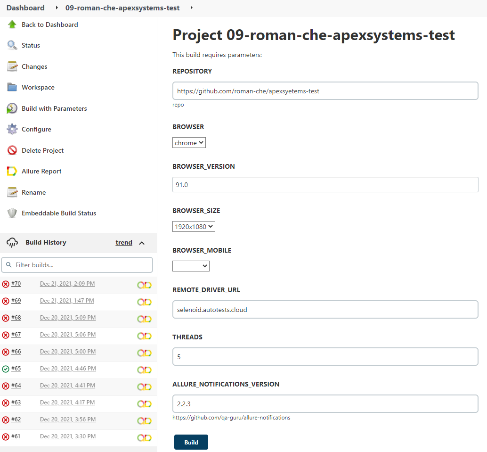
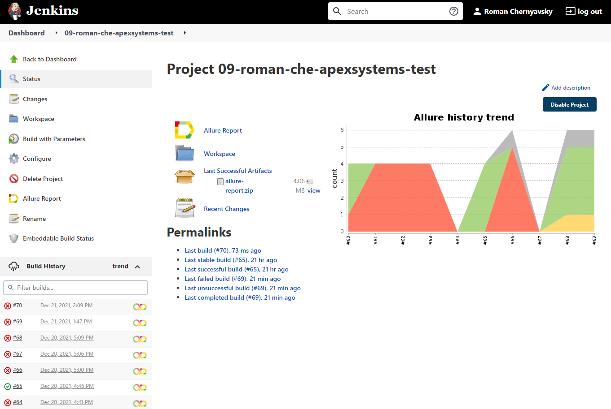
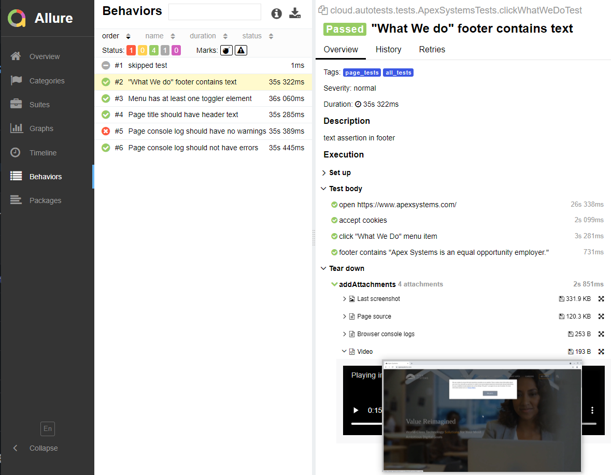
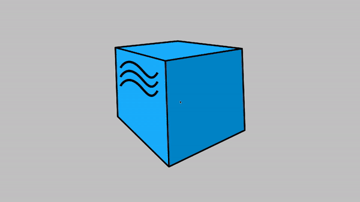
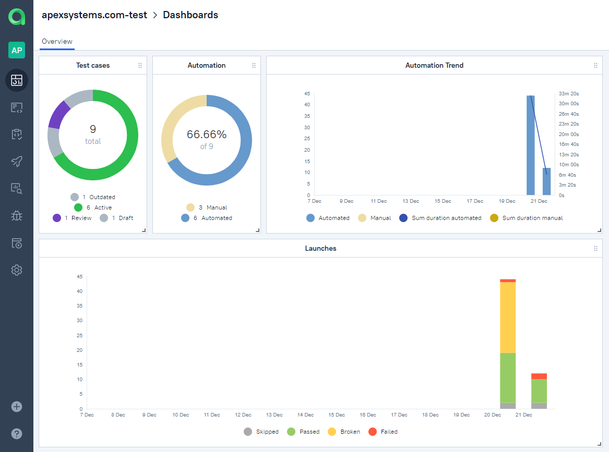
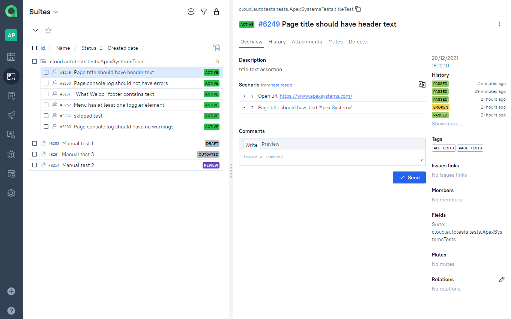
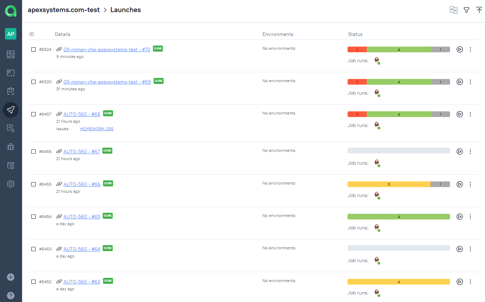
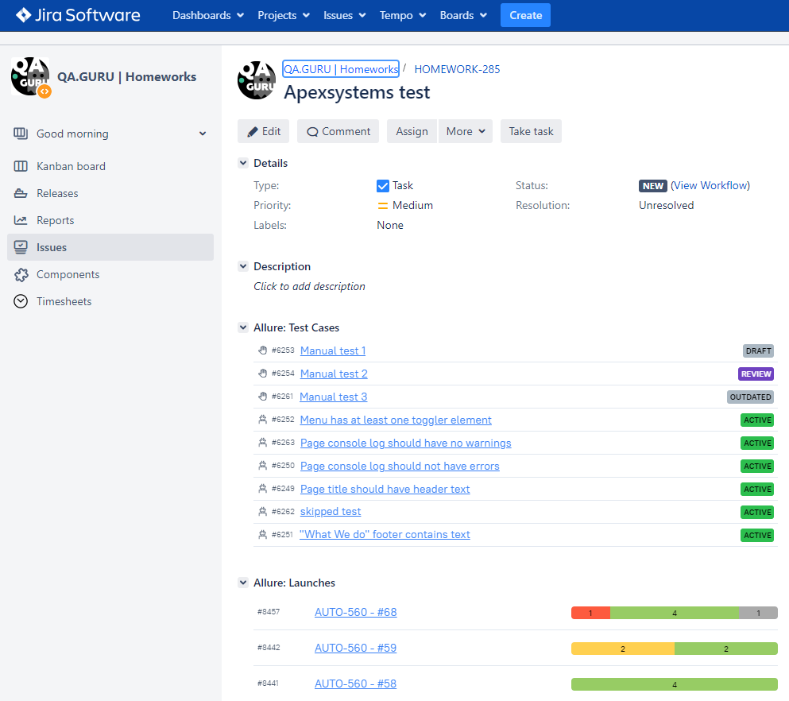
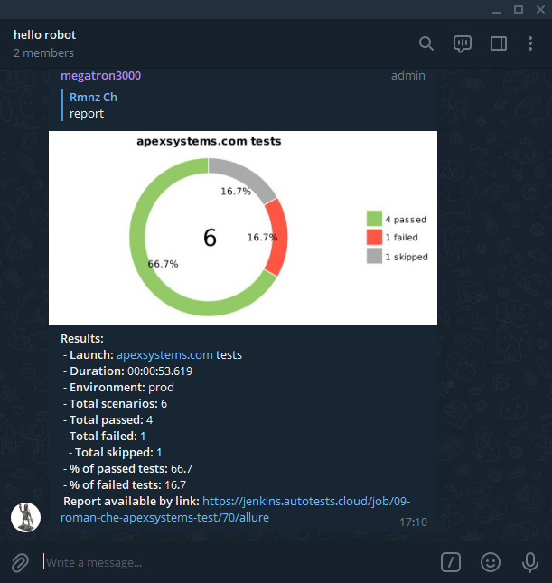

<h2 align="center">Test automation project for <a href="https://www.apexsystems.com/">Apex syetems</a> website</h1>

### Technology stack
<p  align="center">


</p>

### The list of testsm grouped by tags

<details>
<summary>website - page tests:</summary>

+ Menu has at least one toggler element
+ The footer of "What we do" page contains specified text
+ Page title contains specified text
+ Skipped (disabled) test for further development

</details>

<details>
<summary>website - console tests:</summary>

+ Console log contains no errors
+ Console log contains no warnings

</details>

___

## Running tests by local terminal

### Running tests with declared remote properties:

```bash
gradle clean test
```
### Running tests in parametrized build:

```bash
gradle clean
test
-Dtag=${tag}
-Denvironment=${ENVIRONMENT}
-Dbrowser=${BROWSER}
-DbrowserVersion=${BROWSER_VERSION}
-DbrowserSize=${BROWSER_SIZE}
-DbrowserMobileView=${BROWSER_MOBILE}
-DURL=${REMOTE_DRIVER_URL}
-DvideoStorage=https://${REMOTE_DRIVER_URL}/video/
-Dthreads=${THREADS}
```

<details>
<summary>Parameters description</summary>

+ tag — the list of tests, grouped by a tag parameter
+ ENVIRONMENT — environment that runs the build (`prod` — production (defalut value) or `dev` — staging for development)
+ BROWSER — browser to run tests in (`chrome` by default, `opera`, `firefox`, `safari`)
+ BROWSER_VERSION — version off the selected browser (`91.0` by default)
+ BROWSER_SIZE — browser window size (`1920x1080` by default)
+ BROWSER_MOBILE — phone model emulation (`empty` by default, `iPhone X`, `iPad Pro`, `Nexus 7`)
+ REMOTE_DRIVER_URL — address of build running remote browser server (`selenoid.autotests.cloud` by default)
+ videoStorage — address of video storage server (`selenoid.autotests.cloud/video/` by default)
+ threads — number of threads to run the tests (`5` by default)
+ ALLURE_NOTIFICATIONS_VERSION — version of allure notifications software to send the report in external messengers and services (`2.2.3` by default)
</details>


### Serve report:

```bash
allure serve build/allure-results
```

___

## Result analysis

The test results can be observed in:
+ [Jenkins](#jenkins)
+ [Allure Report](#allure-report)
+ [Allure TestOps](#allure-testOps)
+ [Jira](#jira)

### [Jenkins](https://jenkins.autotests.cloud/job/09-roman-che-apexsystems-test)

To the running the tests in Jenkins, [the parameters described above](#running-tests-in-parametrized-build) are required.

With the required parameters set in the "Build with parameters" section, the build will run after clicking the "Build" button.

<p align="center">
  
</p>

Once the build finished, `Allure report` is available by clicking the corresponding link.

<p align="center">
  
</p>

### Allure Report

The image below depicts the Allure report with the list of tests. Each test include predefined tags, steps in "Test body" section and added screenshot, page source, console logs and video as attachments.

<p align="center">
  
</p>


### Video of a running test
Each test in the report have a video attachment. The example of such video is presented below.
<p align="center">
  
</p>


### Allure TestOps

Allure TestOps is used to store all the automated and manual test cases, build launches and results as well as statistics and reports.

Dashboard with launch statistics timeline.

<p align="center">
  
</p>

List of tests with description and sucsess history (some manual tests added below).

<p align="center">
  
</p>

List of launches

<p align="center">
  
</p>

## Jira

The project implements Jira integration, allowing to add issues and assign collaborators

<p align="center">
  
</p>

## Messenger notification

When the build is done, the report is sent by the bot in the Telegram messenger.
The framework used also support notifications via Email, Slack, Skype and Mattermost.

<p align="center">
  
</p>
